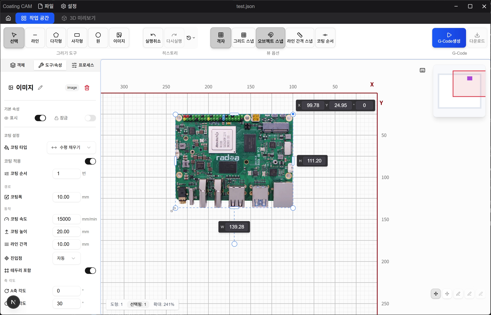
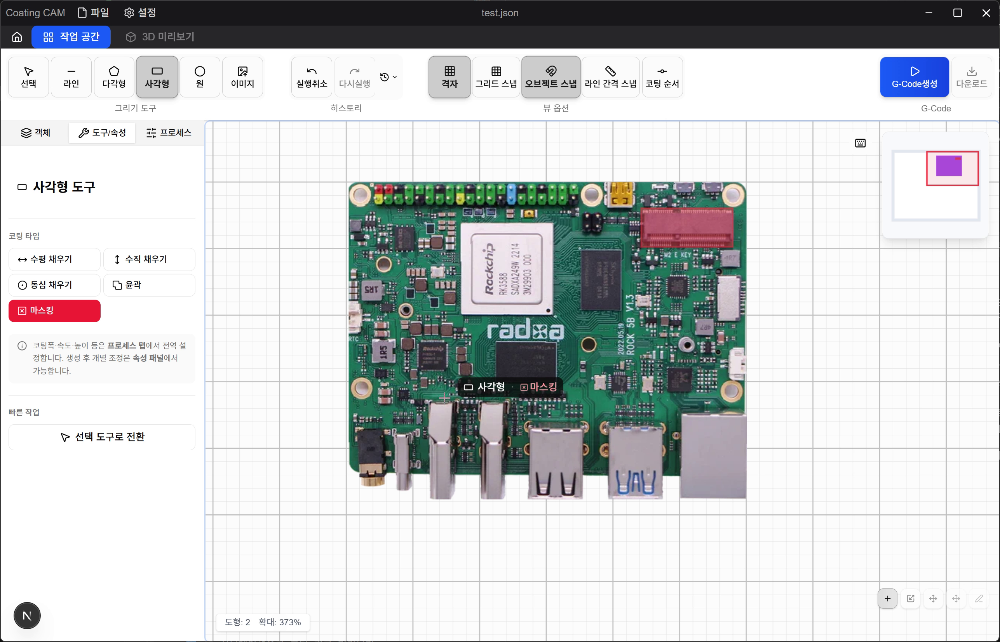
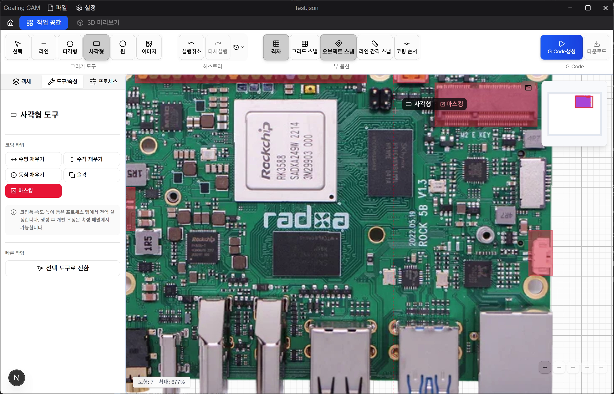
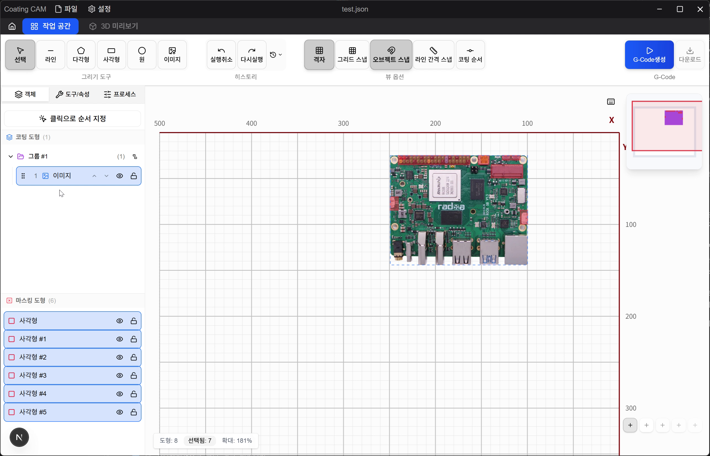
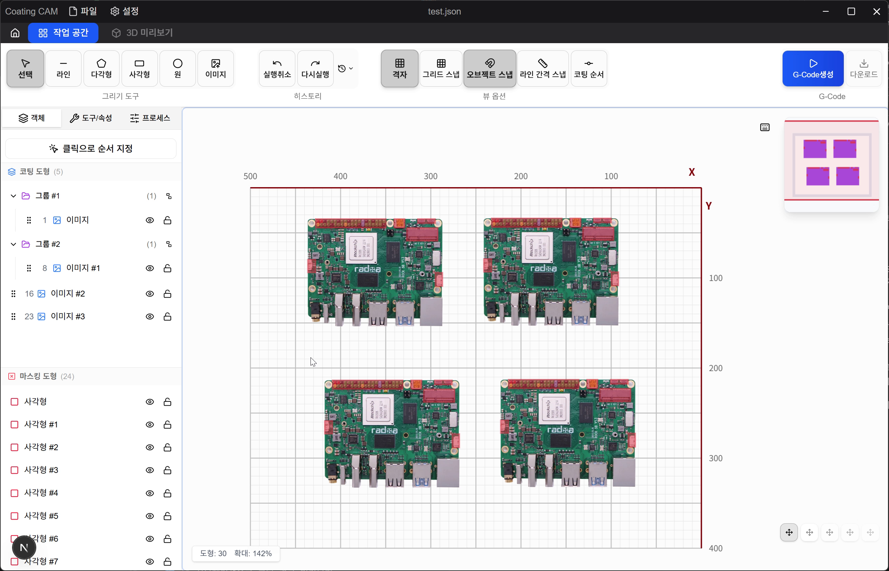
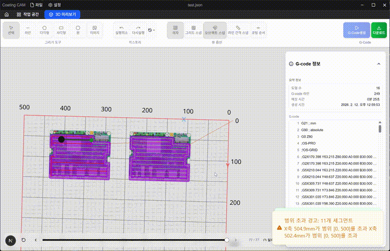
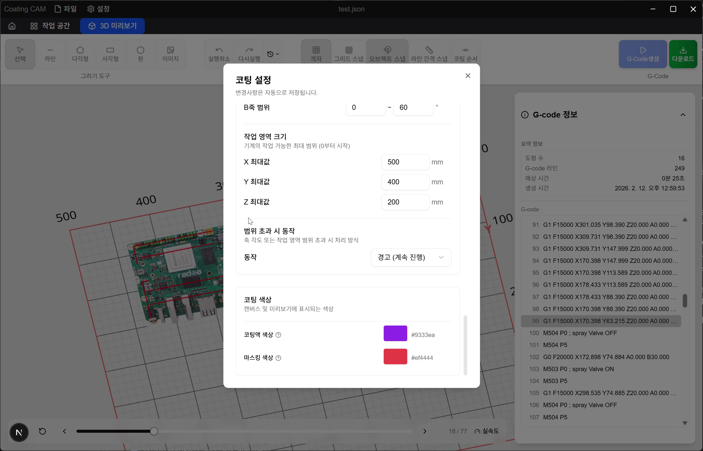
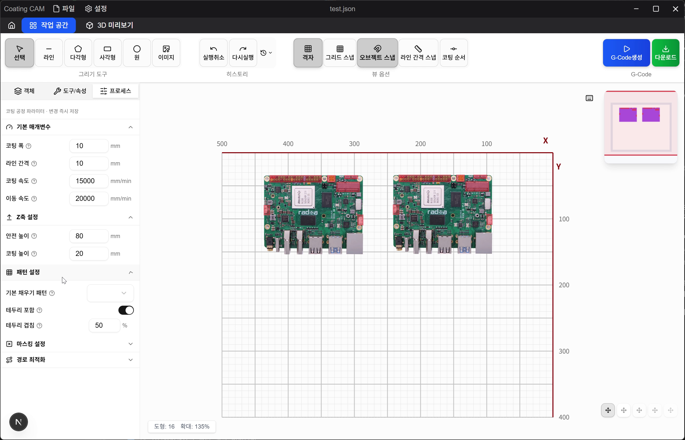

# Coating CAM

[](https://github.com/jewon-oh/coating-cam-release/releases)
[](LICENSE)

> PCB 코팅 경로 생성을 위한 CAM 소프트웨어

## 👀 미리보기

<table align="center">
  <tr>
    <td align="center" width="50%">
      <strong>🖼️ 이미지 보정 · 크롭</strong><br>
      
    </td>
    <td align="center" width="50%">
      <strong>📐 속성 패널 · 코팅 설정</strong><br>
      
    </td>
  </tr>
  <tr>
    <td align="center" width="50%">
      <strong>🎨 마스킹 도형 그리기</strong><br>
      
    </td>
    <td align="center" width="50%">
      <strong>🔍 도형 확대 · 편집</strong><br>
      
    </td>
  </tr>
  <tr>
    <td align="center" width="50%">
      <strong>📋 오브젝트 리스트 · 코팅 순서</strong><br>
      
    </td>
    <td align="center" width="50%">
      <strong>📦 다중 보드 배치</strong><br>
      
    </td>
  </tr>
  <tr>
    <td align="center" colspan="2">
      <strong>🌐 3D G-Code 미리보기</strong><br>
      
    </td>
  </tr>
  <tr>
    <td align="center" width="50%">
      <strong>⚙️ 코팅 설정 다이얼로그</strong><br>
      
    </td>
    <td align="center" width="50%">
      <strong>🏭 공정 패널</strong><br>
      
    </td>
  </tr>
</table>

## 🎯 소개

**Coating CAM**은 PCB 참조 이미지 위에 코팅/마스킹 영역을 설계하고, CNC 장비에 사용할 수 있는 G-Code를 생성하는 데스크톱 애플리케이션입니다.

### 주요 기능

- 🖼️ PCB 이미지를 업로드하고 밝기/대비/투명도 조절
- 🎨 사각형, 원형, 다각형 도형으로 코팅/마스킹 영역 직관적 설계
- ⚙️ 다양한 채우기 패턴 (지그재그, 동심원) 및 밸브 타입 (Spray, Needle, Curtain) 지원
- 🦾 5축(A/B 회전축) 기구학 지원
- 🛡️ 마스킹 영역 자동 회피 경로 생성
- 📐 밀리미터 단위의 정밀한 G-Code 출력
- 🔄 3D 시뮬레이션으로 코팅 경로 미리보기
- 💾 프로젝트 저장/불러오기
- 🔁 자동 업데이트

## 📥 다운로드 및 설치

### 시스템 요구사항

- **OS**: Windows 10 이상

### 설치 방법

1. [Releases](https://github.com/jewon-oh/coating-cam-release/releases) 페이지에서 최신 버전의 **Coating-CAM-Setup-x.x.x.exe** 다운로드
2. 설치 파일 실행 후 안내에 따라 설치
3. 설치 완료 후 앱이 자동 실행됩니다

> 💡 이후 업데이트는 앱 내에서 자동으로 감지되어 설치됩니다.

## 📖 사용 가이드

### 기본 워크플로우

```
이미지 업로드 → 영역 설계 → 코팅 설정 → 미리보기 → G-Code 생성
```

1. **프로젝트 시작** — 홈 화면에서 새 프로젝트 생성 또는 최근 파일 열기
2. **이미지 업로드** — PCB 참조 이미지 업로드 (JPG, PNG, SVG)
3. **영역 설계** — 도형 도구로 코팅/마스킹 영역 배치
4. **코팅 설정** — 도형별 코팅 유형, 패턴, 밸브, 방향 설정
5. **경로 최적화** — 자동 순서 최적화 또는 수동 순서 조정
6. **3D 미리보기** — 코팅 경로 시뮬레이션 확인
7. **G-Code 생성** — 최종 G-Code 파일 다운로드

### 도형 도구

| 도구 | 설명 |
|---|---|
| **선택** | 도형 선택, 이동, 크기 조절, 회전 |
| **사각형** | 사각형 코팅/마스킹 영역 |
| **원형** | 원형 코팅/마스킹 영역 |
| **다각형** | 자유 형태 코팅/마스킹 영역 |
| **직선** | 참조선 (비코팅) |
| **순서 변경** | 코팅 순서를 시각적으로 변경 |

### 코팅 유형

| 유형 | 설명 |
|---|---|
| **Fill** | 도형 내부를 채우기 패턴으로 코팅 |
| **Outline** | 도형 테두리를 따라 코팅 |
| **Masking** | 코팅하지 않는 회피 영역 (장애물 자동 회피) |

### 채우기 패턴

| 패턴 | 설명 |
|---|---|
| **Boustrophedon** | 지그재그 왕복 패턴 (가로/세로 방향 선택 가능) |
| **Concentric** | 동심원 패턴 (바깥→안쪽 또는 안쪽→바깥) |
| **Auto** | 도형에 따라 자동 선택 |

### 밸브 타입

| 밸브 | 특징 |
|---|---|
| **Spray** | 스프레이 도포, 라운드 라인 엔딩 |
| **Needle** | 니들 디스펜싱, 라운드 라인 엔딩 |
| **Curtain** | 커튼 코팅, 직각 라인 엔딩 |

### 코팅 설정 상세

- **코팅 폭** — 노즐 1회 통과 시 코팅 너비 (mm)
- **라인 간격** — 채우기 패턴의 라인 간 거리 (mm)
- **코팅 속도 / 이동 속도** — mm/min 단위
- **안전 높이 / 코팅 높이** — Z축 높이 설정 (mm)
- **Perimeter** — Fill 패턴 시 테두리 경로 포함 여부
- **코팅 방향** — Boustrophedon 패턴의 가로/세로 방향
- **진입점** — 코팅 시작 위치 (자동 / 4개 모서리 / 바깥 / 중심)
- **코너 전환** — Arc(부드러운 곡선) 또는 Sharp(직각)

### 5축 기구학 설정

5축 장비 사용 시 다음 설정을 조정할 수 있습니다:

- **A/B축 각도** — 도형별 노즐 각도 (도, degree)
- **팔 길이** — A축/B축 회전 반경 (mm)
- **축 제한** — A축/B축 최대 회전 범위
- **작업 영역** — X/Y/Z 최대 이동 범위

### G-Code 템플릿

시작/종료 코드를 커스터마이징할 수 있습니다:

```gcode
; 시작 코드 예시
G21           ; mm 단위
G90           ; 절대좌표 모드
G0 Z80        ; 안전 높이로 이동

; 종료 코드 예시
M5            ; spindle off
G0 Z80        ; 안전 높이
G0 X0 Y0      ; 원점 복귀
```

밸브 ON/OFF 명령어(M-Code)도 장비에 맞게 변경할 수 있습니다.

### 키보드 단축키

| 단축키 | 기능 |
|---|---|
| `Ctrl+Z` | 실행 취소 |
| `Ctrl+Y` | 다시 실행 |
| `Ctrl+C / V` | 복사 / 붙여넣기 |
| `Delete` | 선택 도형 삭제 |

> 앱 내 단축키 가이드 오버레이에서 전체 단축키를 확인할 수 있습니다.

## 📄 라이선스

MIT License — 자세한 내용은 [LICENSE](LICENSE) 파일을 참조하세요.

---

Made with ❤️ by [Jewon-Oh](https://github.com/jewon-oh)
